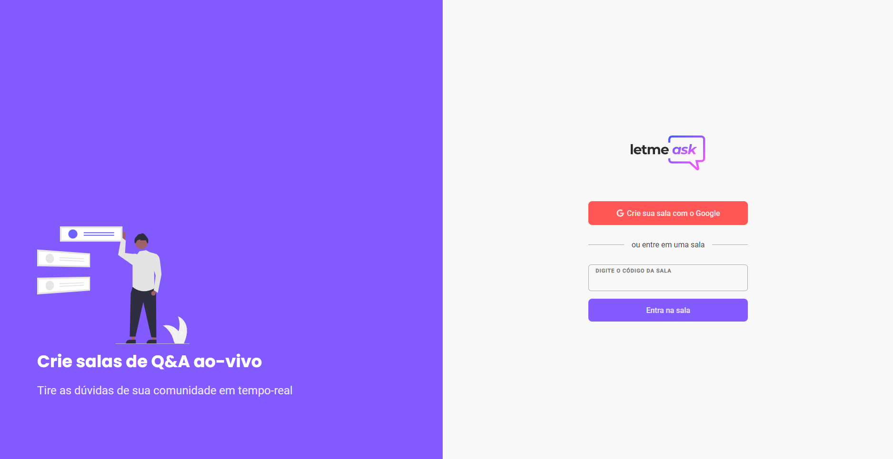

# letmeask

A aplicação tem como proposta de criar salas, aonde outros usuários façam perguntas e tirem suas dúvidas.  
Os usuários também podem dar "like" em uma pergunta do seu interesse.  
O criador da sala pode deletar, dar destaque para a pergunta ou marcar como respondida.  

## 🔧 Ferramentas utilizadas 

<ul>
  <li>
    <a href="https://www.typescriptlang.org">TypeScript</a>
  </li>
  <li>
    <a href="https://pt-br.reactjs.org">React</a>
  </li>
  <li>
    <a href="https://firebase.google.com/?hl=pt">Firebase</a>
  </li>
  <li>
    <a href="https://sass-lang.com">Sass</a>
  </li>
</ul>

## 📚 Outras bibliotecas

<ul>
  <li>
    <a href="https://react-icons.github.io/react-icons">react-icons</a>
  </li>
  <li>
    <a href="https://github.com/JedWatson/classnames#readme">classNames</a>
  </li>
  <li>
    <a href="https://react-hot-toast.com">react-hot-toast</a>
  </li>
  <li><a href="https://reactrouter.com">react-router-dom (v6)</li>
</ul>
